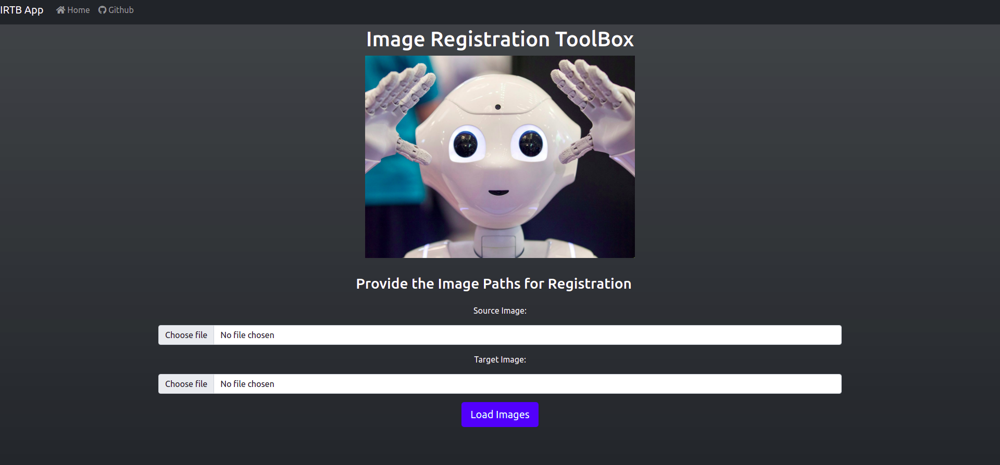
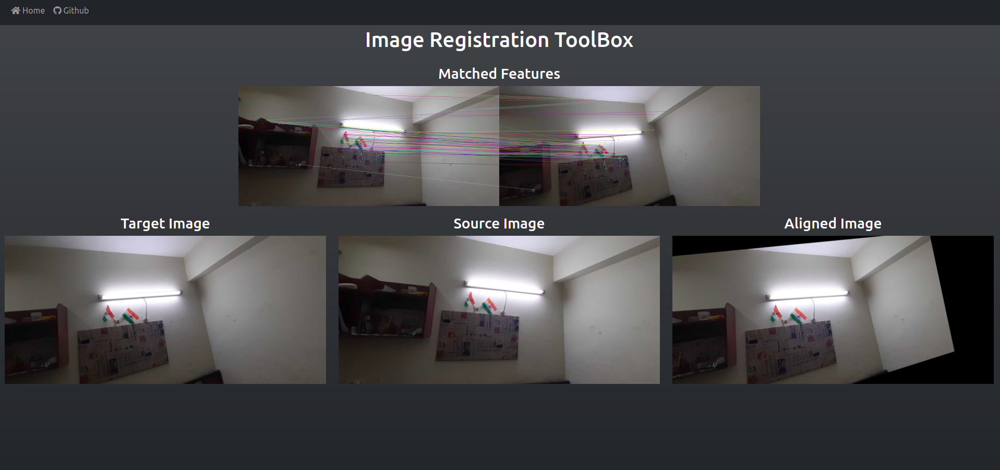

# IRTB APP
Image registration toolbox for feature based image registration demonstration.

## Process to Get the App Running

**Note:** *We can run the project as a standalone electron app or simply as a web app. 
The process to get this running as a web app is give here:*

### Get the toolbox and Install dependencies
```shell
$ gh repo clone ShivamPR21/ImageRegistration-ToolBox
$ cd ImageRegistration-ToolBox
$ git checkout main

# Install Requirements
$ pip3 install pandas matplotlib seaborn opencv-python opencv-contrib-python Flask Flask-WTF
```

### Run the Flask Server
```shell
# Make sure that you are in the project directory
$ python app.py
```

### Open the app in your browser
Put the URL `http://localhost:5000` in your browser search bar and hit Enter.

### Usage:
1. Select images to be registered.
2. Confirm the loaded images and provide the parameters for registration.
3. Hit register images and view the results.

### Load Images:


### Provide Parameters and Details of Registration method


### Output:

