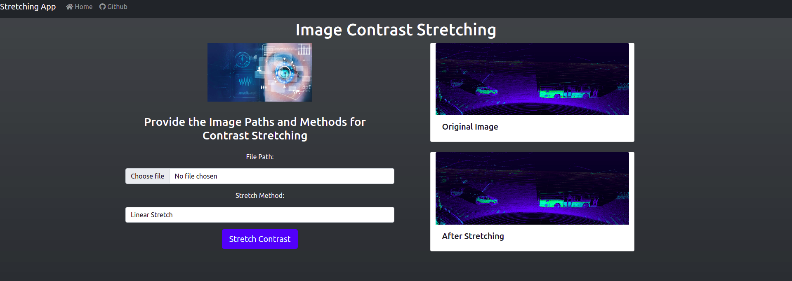
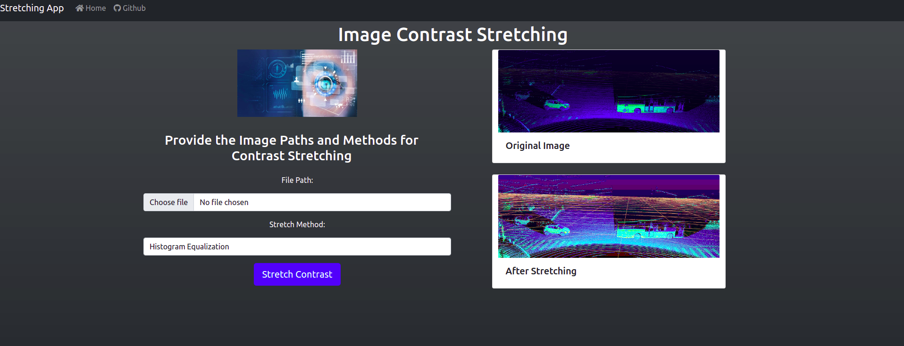
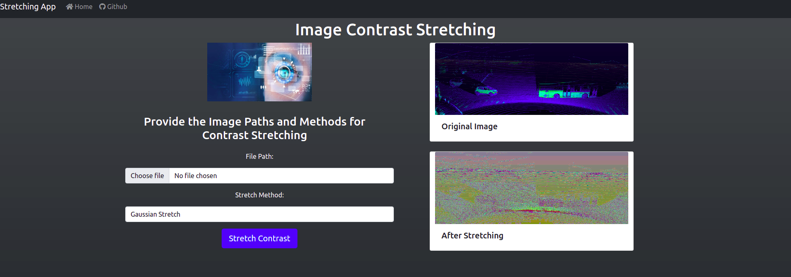

# Image Contrast Stretching APP
The work applies contrast stretching on the images.

## Provided Methods
- Linear Stretching
- Histogram Equalization
- Gaussian Stretching

## Process to Get the App Running

**Note:** *We can run the project as a standalone electron app or simply as a web app. The process to get this running 
as a web app is give here.*

### Get the toolbox and Install dependencies
```shell
$ gh repo clone ShivamPR21/ImageRegistration-ToolBox
$ cd ImageRegistration-ToolBox
$ git checkout str_app

# Install Requirements
$ pip3 install pandas matplotlib seaborn opencv-python opencv-contrib-python Flask Flask-WTF
```

### Run the Flask Server
```shell
# Make sure that you are in the project directory
$ python app.py
```

### Open the app in your browser
<p>Put the URL `http://localhost:5000` in your browser search bar and hit Enter.</p>

### Usage:
1. Select the file RGB images supported formats `png, jpg, jpeg`.
2. Select Method for Contrast stretching
3. Hit `Stretch Contrast`
4. Wait the Results window will load in few minutes based on the speed of your PC.

### Results
#### Linear stretch


#### Histogram Equalization


#### Gaussian Stretch

