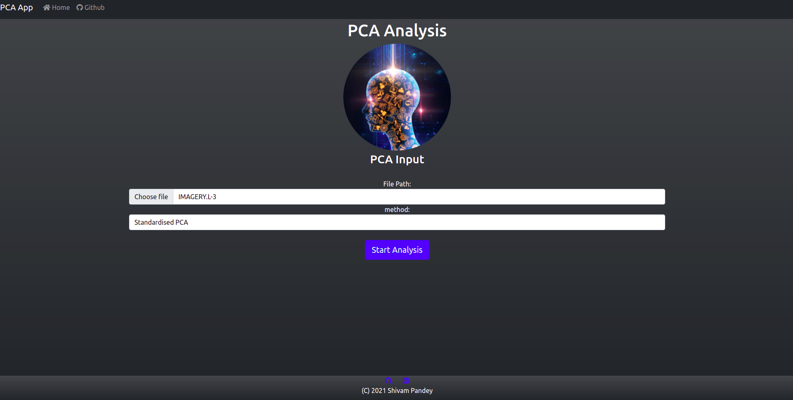
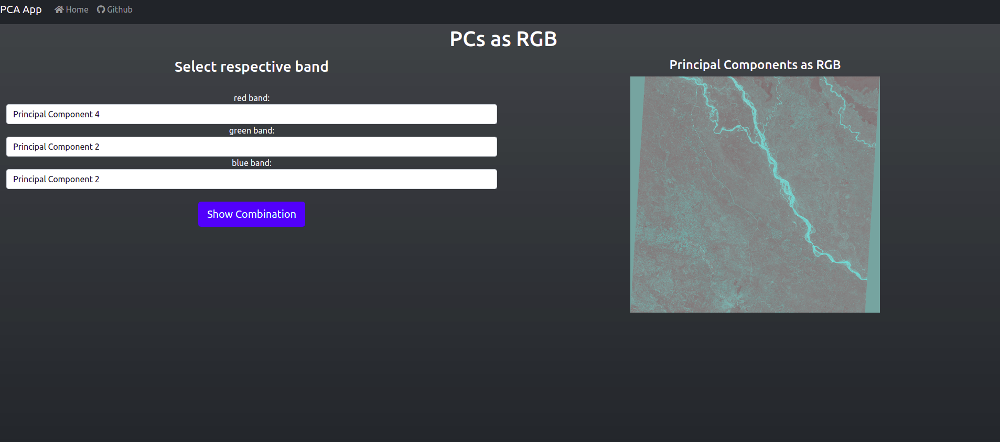

# PCA APP
Principal Component Analysis for Satellite Imagery

## Process to Get the App Running

**Note:** *We can run the project as an sltandalone electron app or simply as a web app. The process to get this running as a web app is give here.*

### Get the toolbox and Install dependencies
```shell
$ gh repo clone ShivamPR21/ImageRegistration-ToolBox
$ cd ImageRegistration-ToolBox
$ git checkout pca_app

# Install Requirements
$ pip3 install pandas matlab seaborn opencv-python Flask Flask-WTF
```

### Run the Flask Server
```shell
# Make sure that you are in the project directory
$ python app.py
```

### Open the app in your browser
Put the URL `http://localhost:5000` in your browser serach bar and hit Enter.

### Usage:
1. Select the file Imagery.L-3
2. Select Method for PCA analysis
3. Hit Start Analysis
4. Wait the Results window will load in few minutes based on the speed of your PC.

### Input Method:


### PCs as PGB combination


### Output:


